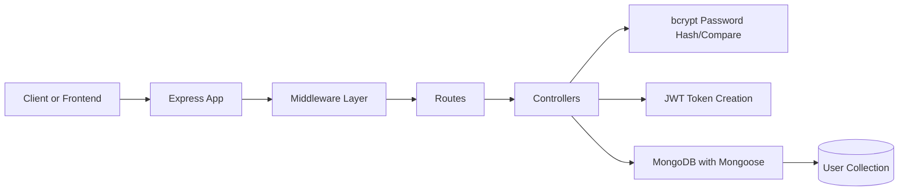

# Smart File Sharing System Cloud


> A clean, practical backend starter for secure user auth in a cloud-ready file-sharing platform.

This project is the core API layer of a smart file-sharing system: fast to run locally, easy to extend, and structured for real-world growth.

## Why this project stands out

- Developer-friendly architecture with separated routes, controllers, and DB layer
- Secure-by-default auth flow with password hashing and JWT token login
- Minimal setup, quick startup, and beginner-friendly code organization
- Great base for adding file upload, link sharing, and cloud storage modules

## Current Features

- User registration endpoint
- User login endpoint
- Password hashing using `bcryptjs`
- JWT token generation on login
- MongoDB connection with Mongoose
- CORS, JSON parsing, URL encoding, and cookie parsing middleware
- Basic test route (`/api/test`) to verify server wiring

## Tech Stack

| Layer | Technology |
|---|---|
| Runtime | Node.js (ES Modules) |
| Framework | Express |
| Database | MongoDB + Mongoose |
| Authentication | JWT (`jsonwebtoken`) |
| Password Security | `bcryptjs` |
| Dev Tooling | `nodemon`, `prettier` |

## Project Structure

```bash
smart-file-sharing-system-cloud/
├── src/
│   ├── app.js
│   ├── index.js
│   ├── db/
│   │   └── index2.js
│   ├── controllers/
│   │   ├── auth.controler.js
│   │   └── user.controler.js
│   ├── routes/
│   │   └── user.routes.js
│   └── modules/
│       └── user.model.js
├── package.json
└── README.md
```

## 3D-Style Project Flow

Here is a visual "3D-like" flow of how this backend currently works:

```txt
            ┌───────────────────────┐
           /      Client/App       /|
          /  (Postman / Frontend) / |
         └───────────────────────┘  |
         |  1) Request API Route  |  |
         |  (/api/auth/*, /test)  |  |
         |                        |  |
         |  2) Express App        |  |
         |  Middleware Layer      |  |
         |  (CORS, JSON, Cookie) |  |
         |                        |  |
         |  3) Route -> Controller|  |
         |  (register / login)    |  |
         |                        |  |
         |  4) Auth Logic         |  |
         |  bcrypt + JWT          |  |
         |                        |  |
         |  5) MongoDB via        |  |
         |  Mongoose Model        | /
         └────────────────────────|/
```

### Mermaid Flow (clean animated-friendly view)



### Optional: Real Interactive 3D

If you want true interactive 3D workflow visualization later, you can add:

- `Three.js` + `react-three-fiber` for custom animated architecture scenes
- `Spline` for drag-and-drop 3D scenes embedded in docs/website
- A dedicated `/docs/architecture` page for live API flow demo

## Quick Start

### 1) Clone and install

```bash
git clone https://github.com/Krishnx21/smart-file-sharing-system.git
cd smart-file-sharing-system-cloud
npm install
```

### 2) Create your `.env`

```env
PORT=8000
MONGO_URI=mongodb://127.0.0.1:27017/smart_file_sharing
CORS_ORIGIN=http://localhost:3000
```

### 3) Run in development

```bash
npm run dev
```

Server starts on:

```txt
http://localhost:8000
```

## API Endpoints (Current)

### Health/Test

| Method | Endpoint | Purpose |
|---|---|---|
| `GET` | `/api/test` | Check route/controller wiring |

### Auth (implemented in controller)

| Method | Endpoint | Purpose |
|---|---|---|
| `POST` | `/api/auth/register` | Create a new user |
| `POST` | `/api/auth/login` | Login and receive token |

> Note: ensure `authRoutes` is wired to these controller methods in your routing layer.

## Sample Request Bodies

### Register

```json
{
  "name": "Krishna",
  "email": "krishna@example.com",
  "password": "StrongPass123"
}
```

### Login

```json
{
  "email": "krishna@example.com",
  "password": "StrongPass123"
}
```

## Roadmap

- Add complete `authRoutes` file and route validation middleware
- Move JWT secret to environment variables
- Add centralized error handling and async wrapper utilities
- Add file upload module and secure sharing links
- Add API documentation (OpenAPI/Swagger)
- Add tests (unit + integration)

## Delivery Phases

### Phase 1 - Foundation         `████████████░░░░`   **DONE**
- ✅ React frontend (Velora design system)
- ✅ Express backend with mock data
- ✅ Basic hybrid chat flow

### Phase 2 - Core AI            `████░░░░░░░░░░░░`   **IN PROGRESS**
- ○ FAQ management dashboard
- ○ Real OpenAI / Gemini integration
- ○ Hindi/Hinglish language tuning
- ○ Persistent MongoDB

### Phase 3 - Human Handoff      `░░░░░░░░░░░░░░░░`   **PLANNED**
- ○ Live agent dashboard
- ○ Socket.io real-time handoff
- ○ Push notifications

### Phase 4 - Ship It            `░░░░░░░░░░░░░░░░`   **PLANNED**
- ○ Production deployment
- ○ WhatsApp Business API

### Phase 5 - Real World         `░░░░░░░░░░░░░░░░`   **PLANNED**
- ○ Pilot with local Indian business
- ○ User feedback -> iterate -> scale this feature

## Contribution

Contributions are welcome. If you want to improve this backend, fork it, build your feature, and open a pull request.

```bash
git checkout -b feature/awesome-improvement
git commit -m "feat: add awesome improvement"
git push origin feature/awesome-improvement
```

## License

ISC

---

If this project helps you, give it a star and build something awesome on top of it.
