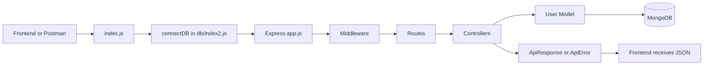

# Smart File Sharing System Cloud


> A beginner-friendly Node.js backend for user authentication and cloud-ready file sharing.

This project is the backend API layer for a smart file-sharing system. It currently supports user registration, user login, JWT token creation, MongoDB connection, password hashing, and starter files for file upload with Multer and Cloudinary.

The codebase also includes easy comments in almost every backend file so the full request flow is easier to understand while learning.

## What This Backend Does

- Starts an Express server
- Connects to MongoDB using Mongoose
- Registers users with `username`, `email`, and `password`
- Hashes passwords before saving them
- Logs users in by checking email and password
- Creates a JWT token after login
- Uses reusable API response and error helper classes
- Includes Multer setup for future file uploads
- Includes Cloudinary upload helper for future cloud storage
- Includes [notes.text](./notes.text) with a full beginner explanation and backend flow

## Tech Stack

| Layer | Technology |
|---|---|
| Runtime | Node.js with ES Modules |
| Framework | Express |
| Database | MongoDB + Mongoose |
| Authentication | JWT (`jsonwebtoken`) |
| Password Security | `bcryptjs` |
| File Upload Starter | Multer |
| Cloud Storage Starter | Cloudinary |
| Dev Tooling | Nodemon, Prettier |

## Project Structure

```bash
smart-file-sharing-system-cloud/
|-- notes.text
|-- package.json
|-- README.md
|-- public/
|-- src/
|   |-- app.js
|   |-- constants.js
|   |-- index.js
|   |-- controllers/
|   |   |-- auth.controler.js
|   |   |-- file.controller.js
|   |   |-- user.controler.js
|   |-- db/
|   |   |-- index2.js
|   |-- middleware/
|   |   |-- multer.middleware.js
|   |-- modules/
|   |   |-- user.model.js
|   |-- routes/
|   |   |-- auth.routes.js
|   |   |-- file.routes.js
|   |   |-- user.routes.js
|   |-- utils/
|       |-- ApiError.js
|       |-- ApiResponse.js
|       |-- asyncHandler.js
|       |-- cloudnary.js
```

## Architecture Diagram

```txt
Frontend / Postman
      |
      | HTTP request
      v
src/index.js
      |
      | loads .env and starts database connection
      v
src/db/index2.js
      |
      | connects backend with MongoDB
      v
src/app.js
      |
      | middleware + route mounting
      v
Routes
      |
      | /api/register  -> user.routes.js
      | /api/login     -> user.routes.js
      | /api/profile   -> user.routes.js
      | /api/auth/...  -> auth.routes.js
      v
Controllers
      |
      | registerUser
      | loginUser
      | getCurrentUser
      v
User Model
      |
      | schema + password hashing
      v
MongoDB
      |
      v
JSON Response
```

## Flow Diagram



## 3D-Style Project Flow

Here is the same backend flow in a simple 3D-style view:

```txt
            +-----------------------+
           /   Client / Postman    /|
          /_______________________ / |
          |                       |  |
          | 1. Send API request   |  |
          |                       |  |
          | 2. Express app.js     |  |
          |    reads middleware   |  |
          |                       |  |
          | 3. Route chooses      |  |
          |    controller         |  |
          |                       |  |
          | 4. Controller runs    |  |
          |    register/login     |  |
          |                       |  |
          | 5. Model talks to     |  |
          |    MongoDB            | /
          |_______________________|/
```

## Request Flow In Easy Language

### Register

```txt
POST /api/register
      |
      v
user.routes.js
      |
      v
registerUser controller
      |
      | check username, email, password
      | check existing email
      | create user
      v
user.model.js hashes password
      |
      v
MongoDB saves user
      |
      v
ApiResponse sends success JSON
```

### Login

```txt
POST /api/login
      |
      v
user.routes.js
      |
      v
loginUser controller
      |
      | check email and password
      | find user
      | compare password using bcrypt
      | create JWT token
      v
ApiResponse sends token
```

### Future File Upload

```txt
Frontend / Postman uploads file
      |
      v
file.routes.js
      |
      v
multer.middleware.js creates req.file
      |
      v
file.controller.js uploads file
      |
      v
cloudnary.js sends file to Cloudinary
      |
      v
MongoDB stores file URL and id
      |
      v
Backend sends shareable file response
```

Current file upload status: starter files exist, but the full upload route and controller are still draft work.

## Quick Start

### 1. Install dependencies

```bash
npm install
```

### 2. Create `.env`

```env
PORT=8000
MONGO_URI=mongodb://127.0.0.1:27017/smart_file_sharing
MONGO_URI_LOCAL=mongodb://127.0.0.1:27017/smart_file_sharing
USE_LOCAL_DB=true
CORS_ORIGIN=http://localhost:3000
JWT_SECRET=your_jwt_secret
CLOUDINARY_CLOUD_NAME=your_cloudinary_cloud_name
CLOUDINARY_API_KEY=your_cloudinary_api_key
CLOUDINARY_API_SECRET=your_cloudinary_api_secret
```

### 3. Run development server

```bash
npm run dev
```

Server starts on:

```txt
http://localhost:8000
```

## API Endpoints

### Main User Routes

These routes are mounted from `src/app.js` using:

```js
app.use("/api", userRoutes);
```

| Method | Endpoint | Purpose |
|---|---|---|
| `POST` | `/api/register` | Create a new user |
| `POST` | `/api/login` | Login and receive JWT token |
| `GET` | `/api/profile` | Return current user placeholder |

### Auth Routes

These routes are mounted from `src/app.js` using:

```js
app.use("/api/auth", authRoutes);
```

| Method | Endpoint | Purpose |
|---|---|---|
| `POST` | `/api/auth/register` | Alternate register route |
| `POST` | `/api/auth/login` | Alternate login route |

Note: the main cleaned-up auth flow is currently in `src/controllers/user.controler.js` and `src/routes/user.routes.js`.

## Sample Request Bodies

### Register

Use this with `POST /api/register`.

```json
{
  "username": "krishna",
  "email": "krishna@example.com",
  "password": "StrongPass123"
}
```

### Login

Use this with `POST /api/login`.

```json
{
  "email": "krishna@example.com",
  "password": "StrongPass123"
}
```

## Main Files Explained

| File | What it does |
|---|---|
| `src/index.js` | Starts backend after database connection |
| `src/app.js` | Creates Express app and connects routes |
| `src/db/index2.js` | Connects backend to MongoDB |
| `src/routes/user.routes.js` | Defines `/api/register`, `/api/login`, `/api/profile` |
| `src/controllers/user.controler.js` | Main register, login, and profile logic |
| `src/modules/user.model.js` | User schema and password hashing |
| `src/utils/ApiResponse.js` | Common success response format |
| `src/utils/ApiError.js` | Common error format |
| `src/utils/asyncHandler.js` | Catches async controller errors |
| `src/middleware/multer.middleware.js` | Handles uploaded files temporarily |
| `src/utils/cloudnary.js` | Upload helper for Cloudinary |
| `notes.text` | Full beginner notes and backend explanation |

## Implementation Steps

### User Register

```js
// 1. Get data from frontend (req.body)
// 2. Validate fields
//    - empty?
//    - valid email?
//    - password length?
// 3. Check if user already exists
//    - email
//    - username
// 4. Save password in model, model hashes it
// 5. Create user in database
// 6. Create clean response object
// 7. Remove password from response
// 8. Check if user created successfully
// 9. Send response
```

### User Login

```js
// 1. Get email and password from frontend
// 2. Validate fields
// 3. Find user by email
// 4. Compare password
// 5. Create JWT token
// 6. Send response
```

### File Upload

```js
// 1. Get file from frontend (req.file)
// 2. Validate file exists
// 3. Upload file to Cloudinary
// 4. Save file URL and public id in database
// 5. Generate shareable link
// 6. Send response
```

## Learning Notes

For a full easy-language explanation, open:

```txt
notes.text
```

That file explains the backend one by one with graph, flow, and implementation steps.

## Roadmap

- Add real `verifyJWT` auth middleware
- Protect `/api/profile`
- Finish file upload controller
- Create file model for uploaded files
- Save Cloudinary URL and public id in MongoDB
- Generate shareable links
- Add centralized Express error middleware
- Add validation for email format and password length
- Add API documentation with Swagger/OpenAPI
- Add tests for register and login

## Contribution

Contributions are welcome. Fork the repo, create a branch, build your feature, and open a pull request.

```bash
git checkout -b feature/awesome-improvement
git commit -m "feat: add awesome improvement"
git push origin feature/awesome-improvement
```

## License

ISC
