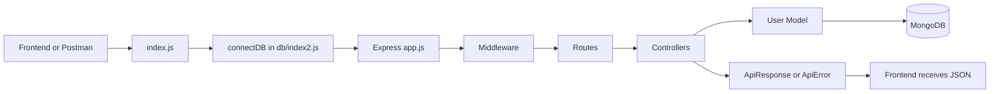

# Smart File Sharing System Cloud


> A beginner-friendly full-stack file sharing system with authentication, Cloudinary uploads, shareable links, QR codes, download tracking, and a React dashboard.

This project includes a Node.js/Express backend and a React/Vite frontend for a smart file-sharing system. It supports user registration, login, JWT authentication, MongoDB storage, Cloudinary uploads, expiring share links, QR code sharing, file history, download counts, delete file, and a local forgot-password reset flow.

The codebase also includes easy comments in almost every backend file so the full request flow is easier to understand while learning.

## Deployment

This project is deployed as two separate services:

| Part | Platform | URL |
|---|---|---|
| Frontend | Vercel | `https://your-vercel-app-url.vercel.app` |
| Backend API | Render | `https://cloud-file-sharing-url.onrender.com` |

The frontend calls the backend through:

```env
VITE_API_BASE_URL=https://cloud-file-sharing-url.onrender.com/api
```

The backend must allow the deployed Vercel frontend origin through CORS:

```env
CORS_ORIGIN=https://your-vercel-app-url.vercel.app
PUBLIC_BASE_URL=https://cloud-file-sharing-url.onrender.com
```

Replace `https://your-vercel-app-url.vercel.app` with the actual Vercel deployment URL.

### Backend Deployment on Render

Create a new Render Web Service from this repository.

Use these settings:

```txt
Root directory: .
Build command: npm install
Start command: npm start
```

Add these Render environment variables:

```env
PORT=8000
MONGO_URI=your_mongodb_atlas_connection_string
USE_LOCAL_DB=false
CORS_ORIGIN=https://your-vercel-app-url.vercel.app
JWT_SECRET=your_jwt_secret
CLOUDINARY_CLOUD_NAME=your_cloudinary_cloud_name
CLOUDINARY_API_KEY=your_cloudinary_api_key
CLOUDINARY_API_SECRET=your_cloudinary_api_secret
PUBLIC_BASE_URL=https://cloud-file-sharing-url.onrender.com
```

After deployment, the API base URL is:

```txt
https://cloud-file-sharing-url.onrender.com/api
```

### Frontend Deployment on Vercel

Create a new Vercel project from the same repository.

Use these settings:

```txt
Root directory: frontend
Build command: npm run build
Output directory: dist
```

Add this Vercel environment variable:

```env
VITE_API_BASE_URL=https://cloud-file-sharing-url.onrender.com/api
```

After changing Vercel or Render environment variables, redeploy the affected service.

## What This Backend Does

- Starts an Express server
- Connects to MongoDB using Mongoose
- Registers users with `username`, `email`, and `password`
- Hashes passwords before saving them
- Logs users in by checking email and password
- Creates a JWT token after login
- Uses reusable API response and error helper classes
- Uploads files to Cloudinary using Multer memory storage
- Saves uploaded file metadata in MongoDB
- Generates shareable links for uploaded files
- Generates QR codes on the frontend for share links
- Tracks download count when a share link is opened
- Supports expiring links
- Supports deleting uploaded files from Cloudinary and MongoDB
- Includes forgot-password and reset-password routes for local testing
- Includes a React/Vite frontend dashboard
- Includes [notes.text](./notes.text) with a full beginner explanation and backend flow

## Tech Stack

| Layer | Technology |
|---|---|
| Runtime | Node.js with ES Modules |
| Framework | Express |
| Database | MongoDB + Mongoose |
| Authentication | JWT (`jsonwebtoken`) |
| Password Security | `bcryptjs` |
| File Upload | Multer memory storage |
| Cloud Storage | Cloudinary |
| Frontend | React + Vite |
| Styling | Tailwind CSS |
| UI/Motion | shadcn-style components + Framer Motion |
| Dev Tooling | Nodemon, Prettier |

## Project Structure

```bash
smart-file-sharing-system-cloud/
|-- notes.text
|-- package.json
|-- README.md
|-- frontend/
|   |-- package.json
|   |-- index.html
|   |-- src/
|       |-- components/
|       |-- context/
|       |-- hooks/
|       |-- pages/
|       |-- routes/
|       |-- services/
|       |-- styles/
|-- public/
|-- src/
|   |-- app.js
|   |-- constants.js
|   |-- index.js
|   |-- controllers/
|   |   |-- auth.controler.js
|   |   |-- file.controller.js
|   |   |-- user.controler.js
|   |-- db/
|   |   |-- index2.js
|   |-- middleware/
|   |   |-- multer.middleware.js
|   |-- modules/
|   |   |-- file.model.js
|   |   |-- user.model.js
|   |-- routes/
|   |   |-- auth.routes.js
|   |   |-- file.routes.js
|   |   |-- user.routes.js
|   |-- utils/
|       |-- ApiError.js
|       |-- ApiResponse.js
|       |-- asyncHandler.js
|       |-- cloudnary.js
```

## Architecture Diagram

```txt
Frontend / Postman
      |
      | HTTP request
      v
src/index.js
      |
      | loads .env and starts database connection
      v
src/db/index2.js
      |
      | connects backend with MongoDB
      v
src/app.js
      |
      | middleware + route mounting
      v
Routes
      |
      | /api/register  -> user.routes.js
      | /api/login     -> user.routes.js
      | /api/profile   -> user.routes.js
      | /api/auth/...  -> auth.routes.js
      | /api/files/... -> file.routes.js
      v
Controllers
      |
      | registerUser
      | loginUser
      | getCurrentUser
      | uploadFile
      | getUserFiles
      | getFileById
      | deleteFile
      v
Models
      |
      | User schema + File schema
      v
MongoDB
      |
      v
JSON Response
```

## Flow Diagram



## 3D-Style Project Flow

Here is the same backend flow in a simple 3D-style view:

```txt
            +-----------------------+
           /   Client / Postman    /|
          /_______________________ / |
          |                       |  |
          | 1. Send API request   |  |
          |                       |  |
          | 2. Express app.js     |  |
          |    reads middleware   |  |
          |                       |  |
          | 3. Route chooses      |  |
          |    controller         |  |
          |                       |  |
          | 4. Controller runs    |  |
          |    register/login     |  |
          |                       |  |
          | 5. Model talks to     |  |
          |    MongoDB            | /
          |_______________________|/
```

## Request Flow In Easy Language

### Register

```txt
POST /api/register
      |
      v
user.routes.js
      |
      v
registerUser controller
      |
      | check username, email, password
      | check existing email
      | create user
      v
user.model.js hashes password
      |
      v
MongoDB saves user
      |
      v
ApiResponse sends success JSON
```

### Login

```txt
POST /api/login
      |
      v
user.routes.js
      |
      v
loginUser controller
      |
      | check email and password
      | find user
      | compare password using bcrypt
      | create JWT token
      v
ApiResponse sends token
```

### File Upload

```txt
Frontend / Postman uploads file
      |
      v
file.routes.js
      |
      v
verifyJWT checks logged-in user
      |
      v
multer.middleware.js stores file in memory
      |
      v
file.controller.js receives req.file.buffer
      |
      v
cloudnary.js uploads buffer to Cloudinary
      |
      v
MongoDB stores file URL and id
      |
      v
Backend sends shareable file response
```

Current file upload status: working with Cloudinary, MongoDB, expiring links, QR sharing, and download counts.

## Quick Start

### 1. Install dependencies

```bash
npm install
```

### 2. Create `.env`

```env
PORT=8000
MONGO_URI=mongodb://127.0.0.1:27017/smart_file_sharing
MONGO_URI_LOCAL=mongodb://127.0.0.1:27017/smart_file_sharing
USE_LOCAL_DB=true
CORS_ORIGIN=http://localhost:5173
JWT_SECRET=your_jwt_secret
CLOUDINARY_CLOUD_NAME=your_cloudinary_cloud_name
CLOUDINARY_API_KEY=your_cloudinary_api_key
CLOUDINARY_API_SECRET=your_cloudinary_api_secret
PUBLIC_BASE_URL=http://localhost:8000
```

`PUBLIC_BASE_URL` is used when generating shareable links and QR codes. For phone QR testing on the same Wi-Fi, use your laptop IP:

```env
PUBLIC_BASE_URL=http://192.168.x.x:8000
```

### 3. Run backend development server

```bash
npm run dev
```

Server starts on:

```txt
http://localhost:8000
```

### 4. Run frontend development server

Open a second terminal:

```bash
cd frontend
npm install
npm run dev
```

Frontend starts on:

```txt
http://localhost:5173
```

Create `frontend/.env` if needed:

```env
VITE_API_BASE_URL=http://localhost:8000/api
```

## API Endpoints

### Main User Routes

These routes are mounted from `src/app.js` using:

```js
app.use("/api", userRoutes);
```

| Method | Endpoint | Purpose |
|---|---|---|
| `POST` | `/api/register` | Create a new user |
| `POST` | `/api/login` | Login and receive JWT token |
| `GET` | `/api/profile` | Return current user placeholder |

### Auth Routes

These routes are mounted from `src/app.js` using:

```js
app.use("/api/auth", authRoutes);
```

| Method | Endpoint | Purpose |
|---|---|---|
| `POST` | `/api/auth/register` | Alternate register route |
| `POST` | `/api/auth/login` | Alternate login route |
| `GET` | `/api/auth/current-user` | Return logged-in user |
| `POST` | `/api/auth/forgot-password` | Generate reset token for local testing |
| `POST` | `/api/auth/reset-password` | Reset password using reset token |

Note: the cleaned-up auth flow is in `src/controllers/user.controler.js`.

### File Routes

These routes are mounted from `src/app.js` using:

```js
app.use("/api/files", fileRoutes);
```

| Method | Endpoint | Purpose |
|---|---|---|
| `POST` | `/api/files/upload` | Upload one file and create a shareable link |
| `GET` | `/api/files` | Get logged-in user's uploaded files |
| `GET` | `/api/files/:id` | Open shared file and increment download count |
| `DELETE` | `/api/files/:id` | Delete owned file from Cloudinary and MongoDB |
| `GET` | `/api/files/upload-mode` | Debug route showing active upload mode |

## Sample Request Bodies

### Register

Use this with `POST /api/register`.

```json
{
  "username": "krishna",
  "email": "krishna@example.com",
  "password": "StrongPass123"
}
```

### Login

Use this with `POST /api/login`.

```json
{
  "email": "krishna@example.com",
  "password": "StrongPass123"
}
```

### Upload File

Use this with `POST /api/files/upload`.

Authorization:

```txt
Bearer Token
```

Body type: `form-data`

| Key | Type | Example |
|---|---|---|
| `file` | File | `resume.pdf` |
| `expiresInDays` | Text | `7` |

Example success response:

```json
{
  "statusCode": 201,
  "message": "File uploaded successfully",
  "data": {
    "id": "file_id",
    "filename": "resume.pdf",
    "url": "https://res.cloudinary.com/...",
    "publicId": "cloudinary_public_id",
    "size": 84282,
    "mimetype": "application/pdf",
    "expiresAt": "2026-06-08T10:11:02.379Z",
    "downloadCount": 0,
    "shareableLink": "http://localhost:8000/api/files/file_id"
  },
  "success": true
}
```

### File History

Use this with `GET /api/files`.

Authorization:

```txt
Bearer Token
```

No request body is needed.

## Main Files Explained

| File | What it does |
|---|---|
| `src/index.js` | Starts backend after database connection |
| `src/app.js` | Creates Express app and connects routes |
| `src/db/index2.js` | Connects backend to MongoDB |
| `src/routes/user.routes.js` | Defines `/api/register`, `/api/login`, `/api/profile` |
| `src/controllers/user.controler.js` | Main register, login, and profile logic |
| `src/modules/user.model.js` | User schema and password hashing |
| `src/modules/file.model.js` | File schema, expiry, and download count |
| `src/utils/ApiResponse.js` | Common success response format |
| `src/utils/ApiError.js` | Common error format |
| `src/utils/asyncHandler.js` | Catches async controller errors |
| `src/middleware/multer.middleware.js` | Reads uploaded files into memory |
| `src/utils/cloudnary.js` | Uploads file buffers to Cloudinary |
| `frontend/src/pages/Dashboard.jsx` | My Files dashboard |
| `frontend/src/pages/Upload.jsx` | Upload and share link experience |
| `frontend/src/pages/FileHistory.jsx` | Search/filter file table |
| `frontend/src/components/file/ShareLinkCard.jsx` | Copy link and QR code sharing |
| `notes.text` | Full beginner notes and backend explanation |

## Implementation Steps

### User Register

```js
// 1. Get data from frontend (req.body)
// 2. Validate fields
//    - empty?
//    - valid email?
//    - password length?
// 3. Check if user already exists
//    - email
//    - username
// 4. Save password in model, model hashes it
// 5. Create user in database
// 6. Create clean response object
// 7. Remove password from response
// 8. Check if user created successfully
// 9. Send response
```

### User Login

```js
// 1. Get email and password from frontend
// 2. Validate fields
// 3. Find user by email
// 4. Compare password
// 5. Create JWT token
// 6. Send response
```

### File Upload

```js
// 1. Get file from frontend (req.file.buffer)
// 2. Validate file exists
// 3. Upload file to Cloudinary
// 4. Save file URL and public id in database
// 5. Generate shareable link
// 6. Send response
```

### Share Link Access

```js
// 1. Find file by MongoDB id
// 2. Check if file exists
// 3. Check if link is expired
// 4. Increase download count
// 5. Redirect to Cloudinary URL
```

## Learning Notes

For a full easy-language explanation, open:

```txt
notes.text
```

That file explains the backend one by one with graph, flow, and implementation steps.

## Current Features

- User register and login
- JWT protected upload routes
- Cloudinary upload using memory storage
- MongoDB file history
- Shareable file links
- QR code sharing in frontend
- Expiring links
- Download count tracking
- Delete file
- Forgot/reset password flow for local testing
- React dashboard with search and filters

## Roadmap

- Add email service for real password reset emails
- Add password-protected share links
- Add public share page with file preview
- Add multi-file collections with one shared link
- Add download-all-as-zip for collections
- Add API documentation with Swagger/OpenAPI
- Add tests for auth, upload, delete, and expiry

## Contribution

Contributions are welcome. Fork the repo, create a branch, build your feature, and open a pull request.

```bash
git checkout -b feature/awesome-improvement
git commit -m "feat: add awesome improvement"
git push origin feature/awesome-improvement
```

## License

ISC
